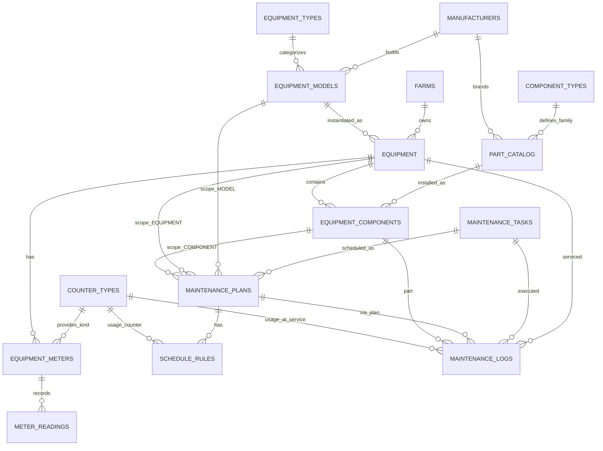

# Farmer Maintenance — Maintenance Scheduling Database

**Author:** © 2025 Susej Reina — All rights reserved.  
This schema and documentation were designed as part of a technical challenge.  
Redistribution or use without explicit permission is prohibited.

---

## 1. Introduction

Managing preventive maintenance for farm equipment is complex. Different machines (tractors, harvesters, sprayers) require service based on hours, mileage, or elapsed time. Even specific **parts** (oil filters, belts, hydraulic pumps) carry their own intervals, which may change if replaced with aftermarket alternatives.  
This schema provides a **robust PostgreSQL 15 data model** (Supabase-ready) to capture equipment, components, counters, tasks, plans, scheduling rules, and maintenance logs.

---

## 2. Assumptions

- **Auditing:** The database includes audit columns (`created_at`, `updated_at`, `created_by`, `updated_by`). It is assumed that user IDs come from **Supabase Auth** (`auth.uid()`) or a similar system. For seeding/imports, `created_by/updated_by` are optional (`NULL` allowed).  
- **Countries:** When listing manufacturers' countries, it is assumed a normalized **countries table** (or enum) exists in another system. For simplicity, this schema keeps it as free text.  
- **Farms:** The farms table registers customer farms and assumes they are active. Accounting/administrative status is managed outside this schema.
- **Scope precedence:** When multiple plans apply, the application resolves specificity in this order: `COMPONENT_INSTANCE > EQUIPMENT > MODEL`.  
- **Multi-tenancy:** It is assumed a single database, multi-tenant model where all tenant data is keyed by `farm_id`, and **Row Level Security (RLS)** restricts access per tenant. If future requirements demand stronger isolation (e.g., legal residency, strict RTO/RPO per tenant, noisy neighbors), migrating to schema-per-tenant or database-per-tenant is viable without redesigning the core entities.
- **Predictive maintenance / IoT integration:** Out of scope for this challenge. It is assume raw high-frequency telemetry is stored in a time-series/analytics store (e.g., TimescaleDB, ClickHouse, BigQuery, or S3/Parquet). The operational Postgres stores only summarized signals and predictions needed by workflows (e.g., a predicted_due_at per equipment/task). This keeps OLTP lean and the architecture modular.

---

## 3. Design Overview

- **Catalogs:** `manufacturers`, `equipment_types`, `counter_types`, `component_types`, `part_catalog` provide normalized anchors.  
- **Farms & Equipment:** `farms` own equipment; each `equipment` references a `model` (which references a manufacturer and type).  
- **Meters & Readings:** `equipment_meters` define usage counters (engine hours, odometer, acres). `meter_readings` store point-in-time values.  
- **Components & Parts:** `equipment_components` represent physical installed parts, tied to `part_catalog` entries.  
- **Maintenance Domain:**  
  - `maintenance_tasks`: catalog of actions (e.g., “Change Engine Oil”).  
  - `maintenance_plans`: bind tasks to a scope (MODEL, EQUIPMENT, COMPONENT_INSTANCE).  
  - `schedule_rules`: one or more rules per plan (USAGE, TIME, RRULE, EVENT).  
  - `maintenance_logs`: record actual service events, with optional usage snapshot.

---

## 4. Entity-Relationship Diagram (Conceptual)



---

## 5. Integrity & Constraints

- **Maintenance plans:** CHECK ensures only one scope is set (MODEL / EQUIPMENT / COMPONENT_INSTANCE).  
- **Schedule rules:** CHECK guards enforce required fields per kind (`USAGE`, `TIME`, `RRULE`).  
- **Maintenance logs:** CHECK ensures `usage_value_at_service >= 0` and requires `usage_counter_id` if a value is provided.  
- **Equipment meters:** Unique per `(equipment_id, counter_type_id)` to avoid duplicates.  
- **Public UUIDs:** Provided for exposure-safe identifiers (`farms.uuid`, `equipment_components.public_id`).

---

## 6. Indexing & Performance

- FKs: all core relationships indexed (equipment → farm/model, models → manufacturer/type).  
- Temporal: `(equipment_id, performed_at)` on logs; `(meter_id, reading_at)` on readings.  
- Plans/rules: indexes on `(task_id)`, `(plan_id, kind, is_active)`.  
- Partitioning (optional): logs and readings by year for scalability.  
- Materialized views (optional): precompute “due in next 30 days.”

---

## 7. Example Usage

- **Oil Change every 250h or 12 months:** Create a task, attach a MODEL-scoped plan, add two rules (`USAGE=250 engine_hours` + `TIME=12 months`).  
- **Aftermarket override:** For one equipment, create an EQUIPMENT-scoped plan with `USAGE=200 engine_hours`.  
- **Replacement reset:** Replace a component, log event, and reset plan with `reset_policy='PART_REPLACEMENT'`.

---

## 8. Setup Instructions

### Prerequisites
- **PostgreSQL 15** (Supabase-compatible).
- A role with privileges to create types, tables, indexes, and extensions.  
  *(The schema enables `pgcrypto` via `CREATE EXTENSION IF NOT EXISTS pgcrypto;`)*

### Files in this repo (in order of execution)
1. **`schema.sql`** – creates enums, tables, FKs, constraints, indexes, and enables `pgcrypto`.
2. **`seed_catalogs.sql`** – loads canonical lookup data (equipment types, counter types, component types, etc.). Idempotent.
3. **`seed_reference.sql`** – loads demo **farm, manufacturers, models, equipment, components, meters, readings**.  
   ⚠️ Starts with `TRUNCATE … RESTART IDENTITY` on several tables (safe on a fresh DB; re-running **resets** those tables).
4. **`seed_usecases_pending.sql`** – defines **tasks, plans, rules** and adjusts readings/installed dates so items show as **due now**. Written to be idempotent (`ON CONFLICT` / `NOT EXISTS` guards).
5. **`views_due.sql`** – creates analytical views:
   - `v_maintenance_due_simple`
   - `v_maintenance_due_now`
   - `v_maintenance_due_effective` (applies precedence: `COMPONENT_INSTANCE > EQUIPMENT > MODEL`)

### Execution
- **Supabase SQL Editor**  
  Open your project → *SQL Editor* → create a new query → paste and run **each file in the order above**.
  1. schema.sql
  2. seed_catalogs.sql
  3. seed_reference.sql
  4. seed_usecases_pending.sql
  5. views_due.sql

### Quick validation
Run one of these after creating the views:
```sql
-- Everything due (after precedence resolution)
SELECT equipment_name, task_code, task_name, rule_kind, next_due_at,
       current_usage_value, usage_every_value, notes
FROM v_maintenance_due_effective
ORDER BY equipment_name, task_code;

-- Or see all computed items (due and not-yet-due)
SELECT * FROM v_maintenance_due_simple ORDER BY equipment_name, task_code, rule_kind;
```

**Expected with provided seeds:**
- **Tractor A** → `ENGINE_OIL_CHANGE` due by **USAGE** (override 200h, current ~210h).
- **Combine X** → `CABIN_AIR_FILTER_REPLACE` due by **TIME** (~8 months since install vs 6 months rule).
- **Tractor B** → `ENGINE_OIL_CHANGE` due by **TIME** (≥12 months since in-service, usage below 250h).


## 9. Partitioning Strategy (Concise)

**When:** Not needed initially. Enable once history grows enough to hurt latency or storage ops.

**Scope:** 
- Partition `meter_readings` by `reading_at` (RANGE, yearly → monthly if volume demands).
- Partition `maintenance_logs` by `performed_at` (RANGE, yearly).

**Why:** Both are append-heavy and time-filtered; partition pruning keeps scans small. Due-date logic remains unchanged.

**Signals to enable:**
- Table > 10–20 GB **o** > 10–20M filas, **o**
- EXPLAIN ANALYZE muestra escaneos grandes en historia.

**Keys & indexes:**
- PKs deben incluir la clave de partición.
- Índices particionados en `(meter_id, reading_at)` y `(equipment_id, performed_at)`.

**Ops:**
- Crear particiones futuras (job mensual/anual).
- Política de retención: p.ej. 5 años “hot”, archivar el resto.
- Mantener tablas resumen para “latest reading / last service” y evitar escanear historia.

> Ver `partitioning_examples.sql` para DDL de referencia.

## 10. Future Enhancements

- **Row Level Security (RLS)** policies per `farm_id` and roles/claims (tenant isolation).  
- **Audit enforcement** triggers to populate `created_by/updated_by` when available.  
- **Summary tables** (or materialized views) for “latest meter reading” and “last service” to avoid scanning history.  
- **Due computation jobs**: background scheduler (pg_cron or Supabase Edge Functions) to populate a “due soon” table for fast dashboards.  
- **Predictive maintenance integration**: persist summarized signals and `predicted_due_at`; keep raw telemetry in a time-series/warehouse store.  
- **Inventory linkage**: BOM resolution for tasks, stock checks for `part_catalog`, reservations.  


## 11. Copyright

© 2025 Susej Reina. All rights reserved.  
This design and code are intellectual property of the author.  
Use or reproduction is not permitted without explicit authorization.

---
